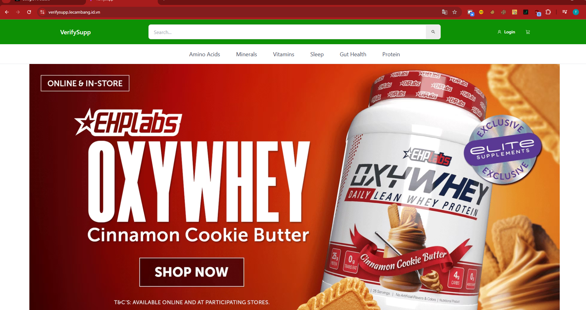
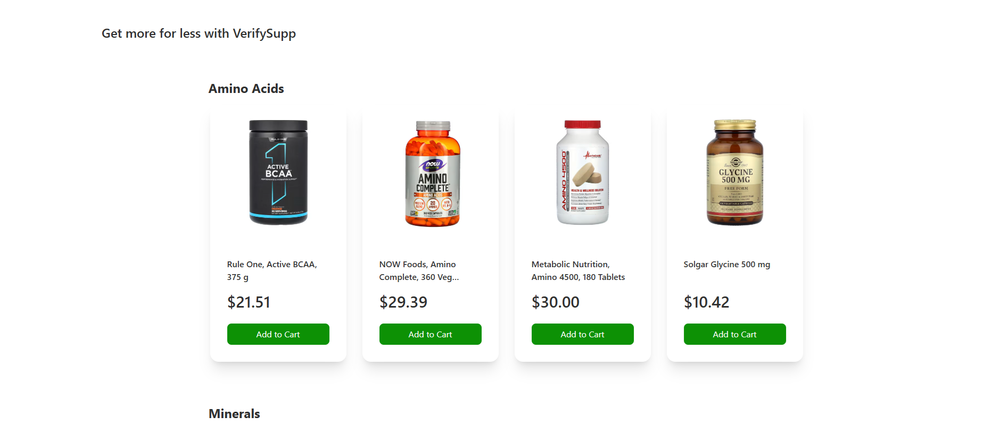

# 🚀 VeriySupp

<div align="center">


[](https://github.com/benf-le/ecommerce_react_redux_vite_nestjs/stargazers)
[](https://github.com/benf-le/ecommerce_react_redux_vite_nestjs/network)
[](https://github.com/benf-le/ecommerce_react_redux_vite_nestjs/issues)
[](LICENSE) <!-- TODO: Add License -->

**A full-stack e-commerce application built with React, Redux, Vite, NestJS, Prisma, and MongoDB.**

[Live Demo](https://verifysupp.lecambang.id.vn/) <!-- TODO: Add live demo link -->

</div>

## 📖 Overview

This project is a complete e-commerce application, demonstrating a modern full-stack architecture.  The frontend utilizes React, Redux for state management, and Vite for rapid development and build optimization.  The backend is powered by NestJS, leveraging Prisma as an ORM for database interactions with MongoDB. Tailwind CSS is used for styling.  This application provides a robust foundation for building scalable and maintainable e-commerce solutions.  The project is designed for developers familiar with React, Redux, and Node.js.

## ✨ Features

- **Product Catalog:** Browse and search a catalog of products.
- **Product Details:** View detailed information about individual products.
- **Shopping Cart:** Add items to a shopping cart and manage quantities.
- **Checkout Process:** Secure checkout process (implementation details TODO).
- **User Accounts:** User registration, login, and account management (implementation details TODO).
- **Admin Panel:**  (Potential feature, not confirmed from code analysis TODO)


## 🖥️ Screenshots

 <!-- TODO: Add actual screenshots -->
 <!-- TODO: Add mobile screenshots -->

## 🛠️ Tech Stack

**Frontend:**

[](https://reactjs.org/)
[](https://redux.js.org/)
[](https://vitejs.dev/)
[](https://tailwindcss.com/)


**Backend:**

[](https://nestjs.com/)
[](https://www.prisma.io/)

**Database:**

[](https://www.mongodb.com/)

**DevOps:**

[](https://cloud.google.com/build)


## 🚀 Quick Start

### Prerequisites

- Node.js (version >=16)
- npm or yarn
- MongoDB (running locally or configured with connection string)


### Installation

1. **Clone the repository:**
   ```bash
   git clone https://github.com/benf-le/ecommerce_react_redux_vite_nestjs.git
   cd ecommerce_react_redux_vite_nestjs
   ```

2. **Navigate to client directory and install client dependencies:**
   ```bash
   cd client
   npm install
   ```

3. **Navigate to server directory and install server dependencies:**
   ```bash
   cd ../server
   npm install
   ```

4. **Environment Setup:**  Create a `.env` file in both the `client` and `server` directories based on the example `.env` files (if provided).  Ensure you have the correct MongoDB connection string.

5. **Start the development servers:**

   In separate terminal windows:
   ```bash
   cd ../client
   npm run dev
   ```
   ```bash
   cd ../server
   npm run start:dev
   ```

6. **Open your browser:** Visit `http://localhost:5173` (React frontend)


## 📁 Project Structure

```
ecommerce_react_redux_vite_nestjs/
├── client/             # React frontend application
│   ├── src/             # Source code
│   ├── public/          # Static assets
│   ├── package.json     # Frontend dependencies
│   └── ...
├── server/             # NestJS backend application
│   ├── src/             # Source code
│   ├── package.json     # Backend dependencies
│   └── ...
└── ...
```

## ⚙️ Configuration

### Environment Variables

**Client:** REACT_APP_API_ENDPOINT

**Server:** DATABASE_URL, JSON_TOKEN_KEY

## 🔧 Development

This section guides developers on how to efficiently work with the project.

### Development Workflow

To develop this application, follow this workflow:

1.  **Run the frontend development server:**
    Open a new terminal, navigate to the `client` directory, and run:
    ```bash
    cd client
    yarn dev
    ```
    This will start the React frontend application, typically accessible at `http://localhost:5173`. It will automatically reload upon changes in the frontend source code.

2.  **Run the backend development server:**
    Open *another* terminal, navigate to the `server` directory, and run:
    ```bash
    cd ../server
    npm run start:dev
    ```
    This will start the NestJS API backend. NestJS comes with built-in hot-reloading functionality, so changes to your backend source code will be automatically recompiled and the server restarted. The API defaults to running on `http://localhost:3001`.

3.  **Database Changes (Prisma Migrations):**
    If you make changes to your Prisma schema (`server/prisma/schema.prisma`), you'll need to generate and apply a migration:
    ```bash
    cd server
    npx prisma generate
    npx prisma db push
    ```
    Replace `<migration_name>` with a name describing your changes (e.g., `add_users_table`).

### Useful Commands

Here are some common `package.json` script commands you might use during development:

**Frontend (in `client/` directory):**

*   `npm run dev`: Starts the Vite development server.
*   `npm run build`: Builds the app for production.
*   `npm run lint`: Runs ESLint to check for code issues.
*   `npm run preview`: Previews the production build locally.

**Backend (in `server/` directory):**

*   `npm run start:dev`: Runs the application in development mode (with hot-reloading).
*   `npm run build`: Compiles TypeScript to JavaScript.
*   `npm run start:prod`: Runs the compiled application in production mode.
*   `npm run lint`: Runs ESLint to check for code issues.
*   `npx prisma studio`: Launches Prisma Studio to view and edit your database data.


## 🚀 Deployment

This project uses Google Cloud Build for deployment. The `cloudbuild.yaml` file contains the deployment configuration. 


## 🙏 Acknowledgments

- React
- Redux
- Vite
- NestJS
- Prisma
- MongoDB
- Tailwind CSS


---

<div align="center">

**⭐ Star this repo if you find it helpful!**

Made with ❤️ by benf-le

</div>